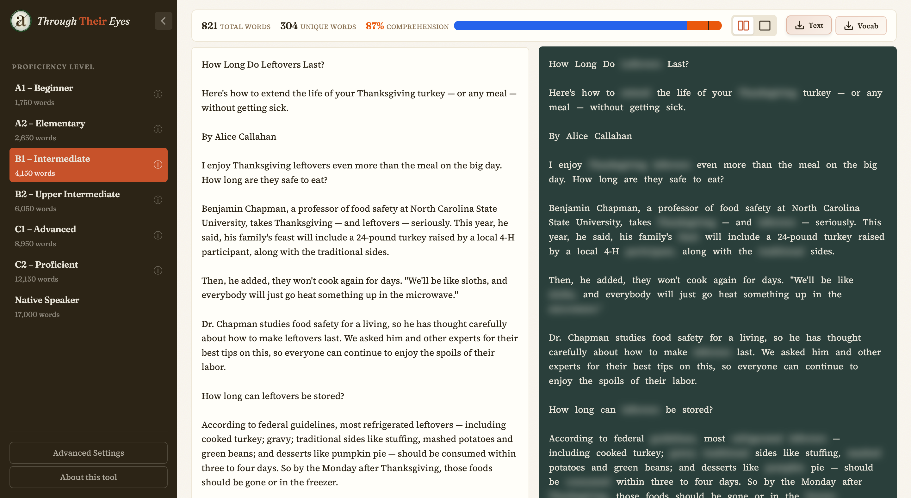

# Through Their Eyes

A reading level visualization tool that helps educators understand how text appears to students with different vocabulary levels. Words outside a student's expected vocabulary are blurred instantly as you type, simulating the reading experience of language learners at different CEFR levels (A1-C2).



## Features

- **Live blur preview** — Words blur instantly as you type (300ms debounce)
- **Proper noun detection** — Names, places, and organizations automatically excluded
- **Two frequency corpora** — Spoken (SUBTLEX movie subtitles) or Written (Google web corpus)
- **CEFR vocabulary levels** — A1 through C2 plus Native speaker thresholds
- **95% comprehension indicator** — Visual bar showing if text meets research threshold
- **Lemmatization** — Groups inflected forms (run/runs/running/ran) under base lemmas
- **Reader view** — Distraction-free mode for presenting to students

## Getting Started

```bash
npm install
npm run dev
```

## Data Sources

- **Spoken corpus**: [SUBTLEX word frequency](https://www.kaggle.com/datasets/lukevanhaezebrouck/subtlex-word-frequency) (60K words from movie subtitles)
- **Written corpus**: [English word frequency](https://www.kaggle.com/datasets/rtatman/english-word-frequency) (307K words from Google Web Trillion Word Corpus)
- **CEFR thresholds**: [myvocab.info](https://www.myvocab.info/en)

## TODO

- [x] **UI Redesign** - Modernize the interface for better aesthetics and usability
- [x] **95% Comprehension Threshold** - Display percentage of known words
- [x] **CEFR Vocabulary Levels** - Implement standardized A1-C2 vocabulary tiers
- [x] **Lemmatization** - Group inflected forms under base lemmas
- [x] **Spoken Corpus** - Add SUBTLEX movie subtitle corpus
- [x] **Proper Noun Handling** - Detect names, places, organizations via NER
- [x] **Live Preview** - Instant blur as you type with side-by-side editor
- [ ] **Custom Ignore List** - Click on a word to add it to a custom "ignore" list
- [ ] **AI Simplification** - Use AI to generate a simpler version at selected reading level
- [ ] **Word Details on Hover** - Show frequency rank and definition when hovering
